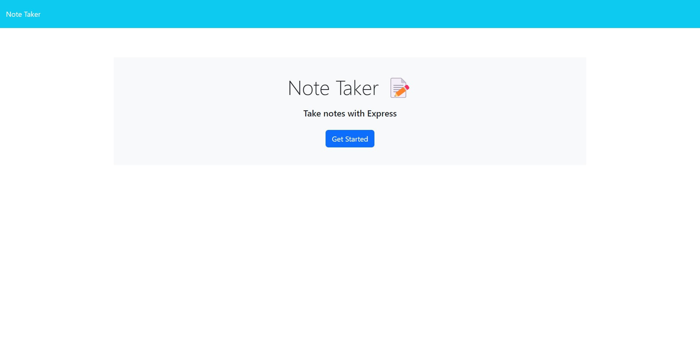

# Jot-a-Thought

This is a website that allows you to save notes for you to use later.

## Description

You start out in the home page of the website. When you click the get started button on the page, it takes you to a page where you can store your notes in. When you want to make a new note, you have to click the plus icon, type in your note in the textboxes, and press the save icon. You will see the saved note in the left side of the screen along with the other saved notes you make. You can display them by clicking their respective bars. If you want to delete a note, you just click the red bin button on the respective note on the left. 

## Deployment

[Heroku Website](https://thawing-shelf-17979.herokuapp.com/)

## Author

Corbin Spence

## Screenshot

